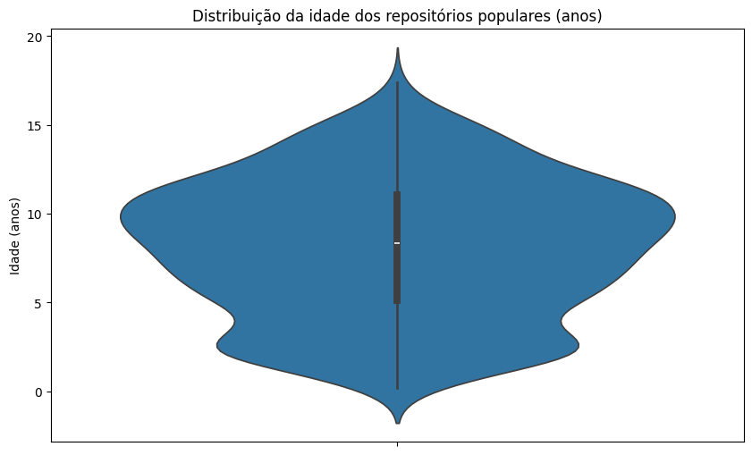
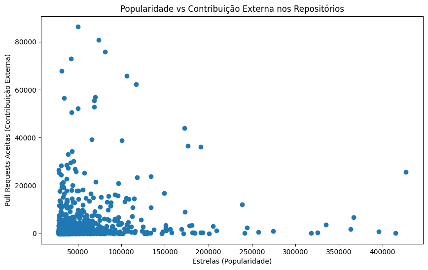
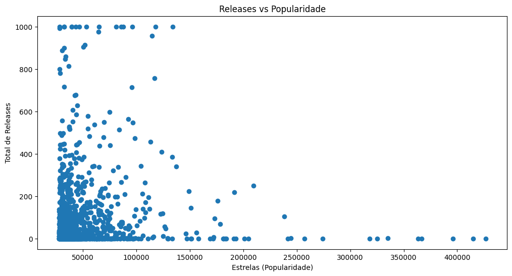
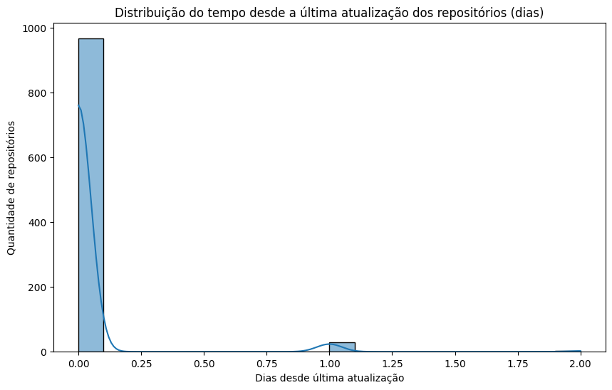
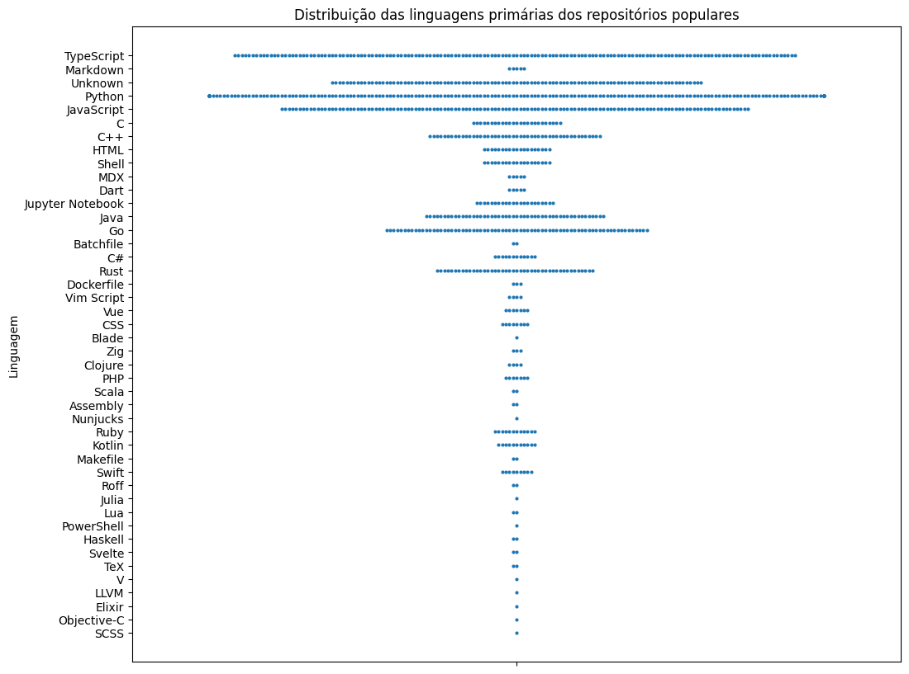
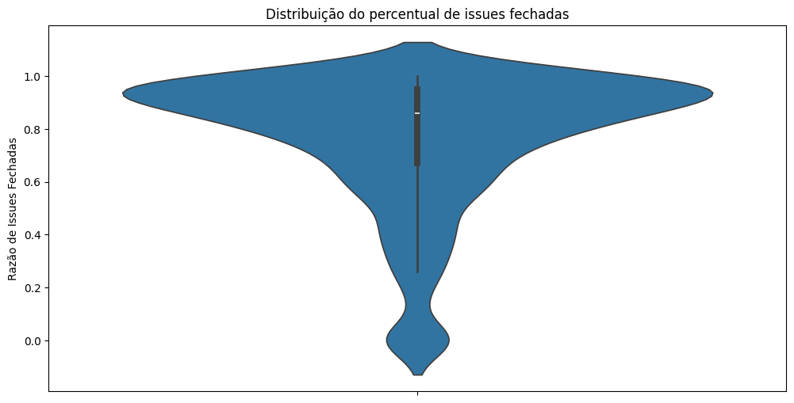
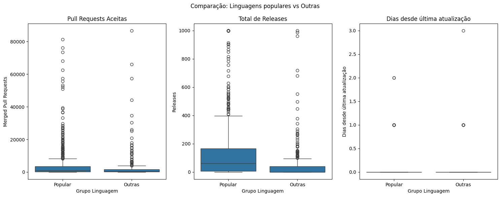
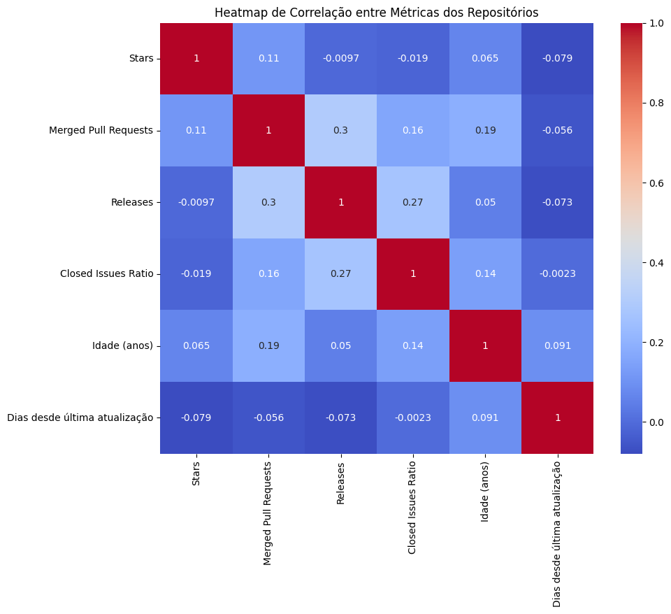

# Relatório técnico: Características de Repositórios Populares do GitHub

## Objetivo

Este projeto realiza a coleta automática de dados e métricas dos 1000 repositórios públicos mais populares no GitHub. São obtidas informações como número de estrelas, linguagem principal, releases, issues abertas e fechadas, pull requests mesclados, data de criação e última atualização.

## Linguagem de Programação

O experimento foi desenvolvido utilizando Python 3.11.0, escolhido pelo suporte a bibliotecas modernas e ampla compatibilidade com pacotes de análise de dados e requisições HTTP.

## Requisitos do Projeto

Para executar o experimento, são necessários:

- Python 3.11.0 ou superior
- Token de autenticação do GitHub
- Pacotes Python:
  - `requests`: para realizar requisições HTTP à API do GitHub
  - `keyring`: para recuperar o token de autenticação armazenado de forma segura
  - `pandas`: para manipulação e análise dos dados coletados
  - `seaborn`: para visualização gráfica das métricas dos repositórios
  - `matplotlib`: para suporte à renderização e salvamento dos gráficos

## API Utilizada

Foi utilizada a GitHub API para coletar os dados necessários dos repositórios. Mais detalhes sobre a API podem ser encontrados na documentação do GitHub REST API.

- [GitHub REST API Documentation](https://docs.github.com/pt/rest?apiVersion=2022-11-28)

## Funcionalidades

- Consulta automática aos 1000 repositórios mais populares do GitHub (ordenados por estrelas).
- Utilização da API GraphQL para coletar informações detalhadas.
- Requisições automáticas com tolerância a erros temporários (retries para status 502, 503 e 504).
- Cálculo da razão de issues fechadas em relação ao total de issues.
- Criação de gráficos com uso de Searborn.

## Metodologia

### 1. Escopo

- Coletar dados dos 1000 repositórios públicos mais populares, ordenados pelo número de estrelas.
- O critério de popularidade foi definido pela contagem de estrelas (stargazerCount).

### 2. Coleta de dados:

A coleta de dados foi realizada utilizando a API do GitHub para obter informações detalhadas dos 1000 repositórios públicos mais populares, ordenados pelo número de estrelas. Como critério do experimento, foram considerados apenas os repositórios públicos com pelo menos uma estrela. Repositórios privados ou com menos relevância em termos de popularidade não foram incluídos na análise.

### 3. Implementação da Coleta

- Linguagem de consulta: Foi utilizado o GraphQL para consultas sob medida, evitando overfetching ou underfetching de informações. Essa abordagem também reduz o número de requisições, oferece paginação mais eficiente e diminui a carga tanto na API quanto no script de coleta.
- Paginação: Foram utilizadas funções para lidar com paginação, permitindo obter resultados em lotes de 100 repositórios por requisição e garantindo maior estabilidade da coleta devido ao grande número de repositórios consultados, mantendo maior controle do progresso e respeitando os limites de requisição da API.
- Cálculo de Issues: Foi utilizado um método para calcular a razão de issues fechadas em relação ao total de issues do repositório, obtida dividindo-se o número de issues fechadas pelo número total de issues (abertas + fechadas). Essa métrica fornece uma indicação da eficiência de resolução de problemas e do nível de manutenção do projeto, permitindo comparar a capacidade de gerenciamento de issues entre repositórios populares.
- Ordenação dos resultados: A query de busca retorna os repositórios em ordem decrescente de estrelas, salvando no CSV sem aplicar nenhuma ordenação adicional, sendo essa determinada pela própria API do GitHub.
- Tolerância a falhas: Foi implementado um mecanismo básico de tolerância a falhas, onde são disparadas requisições automáticas com tolerância a erros temporários (mas limitado a erros temporários da API), incluindo retries para os status 502, 503 e 504.

3. Métricas Coletadas

Para cada repositório, foram obtidas as seguintes métricas:

- Número de estrelas (stargazerCount)
- Dono/proprietário do repositório
- Data de criação e última atualização
- Linguagem primária do projeto
- Número de releases
- Número de issues abertas e fechadas
- Razão de issues fechadas sobre o total
- Número de pull requests mesclados

4. Análise Gráfica

Para explorar os dados coletados e responder às questões de pesquisa (RQs), foram criados gráficos utilizando Python com a biblioteca Seaborn, incluindo:

- Violin Plot: Distribuição da idade dos repositórios e percentual de issues fechadas.
- Histograma (histplot): Distribuição de tempo desde a última atualização dos repositórios.
- Scatter Plot: Relação entre estrelas e número de releases, e entre estrelas e pull requests aceitas.
- Swarmplot: Distribuição das linguagens primárias dos repositórios populares.
- Boxplot: Comparação entre linguagens populares (Python, JavaScript, TypeScript, Java, C#, C++, PHP, Shell, C, Go) e outras linguagens quanto à contribuição externa, lançamento de releases e frequência de atualizações.
- Heatmap: Correlação entre todas as métricas coletadas para identificar padrões e relações.

Cada gráfico foi salvo em arquivo PNG para posterior análise e interpretação dos resultados.

5. Execução e Validação

- O script foi implementado em Python e os dados coletados foram salvos em um arquivo CSV (repos_data.csv) para posterior análise.
- O tempo total de execução foi registrado para avaliação de desempenho do processo de coleta e análise.
- Todos os dados e gráficos foram revisados para garantir consistência, completude e confiabilidade nas interpretações.

### Tempo Médio de Execução

Devido à paginação dos resultados retornados pela API do GitHub, o script tem um tempo médio de execução de aproximadamente **12 minutos**.  
Esse tempo pode variar conforme o número de repositórios processados e o limite de resultados por página.

### Estrutura do Arquivo CSV

O arquivo **repos_data.csv** gerado pelo script contém as seguintes colunas:

- **name**: Nome do repositório.
- **stars**: Número de estrelas recebidas.
- **language**: Linguagem de programação principal utilizada.
- **releases**: Número de releases publicadas.
- **open_issues**: Número de issues abertas.
- **closed_issues**: Número de issues fechadas.
- **merged_prs**: Número de pull requests mesclados.
- **created_at**: Data de criação do repositório.
- **updated_at**: Data da última atualização do repositório.

### Exemplo de Dados

| name           | stars | language   | releases | open_issues | closed_issues | merged_prs | created_at          | updated_at          |
| -------------- | ----- | ---------- | -------- | ----------- | ------------- | ---------- | ------------------- | ------------------- |
| example-repo-1 | 1500  | Python     | 10       | 5           | 50            | 20         | 2020-01-01T12:00:00 | 2025-08-29T12:00:00 |
| example-repo-2 | 1200  | JavaScript | 8        | 3           | 30            | 15         | 2019-05-15T12:00:00 | 2025-08-28T12:00:00 |

---

Esses dados podem ser utilizados para **análise estatística**, **visualização de tendências** e **comparação** entre repositórios populares no GitHub.

## Hipóteses Informais para as Questões de Pesquisa

A seguir, são apresentadas as **questões de pesquisa (RQs)** e as respectivas **hipóteses informais** que orientarão a análise dos dados:

- **RQ 01. Sistemas populares são maduros/antigos?**

  - **Hipótese Informal:** Espera-se que **sistemas populares sejam maduros/antigos**, pois a longevidade geralmente contribui para a sua popularidade e estabilidade. Um projeto com mais tempo de existência tende a ter mais funcionalidades, uma base de usuários estabelecida e maior confiança na comunidade.

- **RQ 02. Sistemas populares recebem muita contribuição externa?**

  - **Hipótese Informal:** Espera-se que **sistemas populares recebam um alto volume de contribuições externas** (medido pelo total de _pull requests_ aceitas), indicando uma comunidade ativa e engajada que impulsiona o desenvolvimento e a melhoria contínua do projeto.

- **RQ 03. Sistemas populares lançam _releases_ com frequência?**

  - **Hipótese Informal:** Espera-se que **sistemas populares lancem _releases_ com frequência**, demonstrando um desenvolvimento contínuo e a entrega regular de novas funcionalidades, correções de bugs ou melhorias aos usuários. Isso sinaliza um projeto ativo e bem mantido.

- **RQ 04. Sistemas populares são atualizados com frequência?**

  - **Hipótese Informal:** Espera-se que **sistemas populares sejam atualizados com muita frequência**, o que é crucial para manter a relevância, segurança, compatibilidade com novas tecnologias e para atender às demandas dos usuários e do ecossistema.

- **RQ 05. Sistemas populares são escritos nas linguagens mais populares?**

  - **Hipótese Informal:** Espera-se que **sistemas populares sejam majoritariamente escritos nas linguagens de programação mais populares**, o que facilita a contribuição de uma base maior de desenvolvedores e a adoção por um público mais amplo, dado que essas linguagens possuem mais ferramentas, documentação e suporte.

- **RQ 06. Sistemas populares possuem um alto percentual de _issues_ fechadas?**

  - **Hipótese Informal:** Espera-se que **sistemas populares possuam um alto percentual de _issues_ fechadas**, refletindo a eficiência da equipe de desenvolvimento em resolver problemas, responder às necessidades dos usuários e manter a qualidade do projeto. Um bom gerenciamento de _issues_ é um indicativo de maturidade do projeto.

- **RQ 07. Sistemas escritos em linguagens mais populares (Python, JavaScript, TypeScript, Java, C#, C++, PHP, Shell, C, Go) recebem mais contribuição externa, lançam mais releases e são atualizados com mais frequência?**  

  - **Hipótese Informal:** Espera-se que **sistemas populares escritos em linguagens mais populares recebam mais contribuição externa, lançem mais releases e sejam atualizados com mais frequência**, refletindo a relevância para a comunidade e o engajamento dos usuários.

## Resultados Obtidos

Considerando número de stars, os seguintes repositórios foram ranqueados como os mais populares:

| Ranking | Repositório                                                                           | Stars  | Issues Abertas | Issues Fechadas | Linguagem Principal |
| ------- | ------------------------------------------------------------------------------------- | ------ | -------------- | --------------- | ------------------- |
| 1       | [freeCodeCamp](https://github.com/freeCodeCamp/freeCodeCamp)                          | 426781 | 191            | 19655           | TypeScript          |
| 2       | [build-your-own-x](https://github.com/codecrafters-io/build-your-own-x)               | 415049 | 231            | 595             | Markdown            |
| 3       | [awesome](https://github.com/sindresorhus/awesome)                                    | 395836 | 14             | 340             | Unknown             |
| 4       | [free-programming-books](https://github.com/EbookFoundation/free-programming-books)   | 366700 | 30             | 1152            | Python              |
| 5       | [public-apis](https://github.com/public-apis/public-apis)                             | 363296 | 13             | 704             | Python              |
| 6       | [developer-roadmap](https://github.com/kamranahmedse/developer-roadmap)               | 334911 | 251            | 2693            | TypeScript          |
| 7       | [coding-interview-university](https://github.com/jwasham/coding-interview-university) | 325391 | 63             | 453             | Unknown             |
| 8       | [system-design-primer](https://github.com/donnemartin/system-design-primer)           | 317963 | 250            | 91              | Python              |
| 9       | [996.ICU](https://github.com/996icu/996.ICU)                                          | 274197 | 0              | 0               | Unknown             |
| 10      | [awesome-python](https://github.com/vinta/awesome-python)                             | 257287 | 0              | 0               | Python              |

### RQ 01. Idade dos repositórios

### RQ 02. Pull Requests Aceitas vs Popularidade

### RQ 03. Total de Releases vs Popularidade

### RQ 04. Tempo desde a última atualização

### RQ 05. Distribuição das linguagens primárias

### RQ 06. Percentual de Issues Fechadas

### RQ 07. Contribuição Linguagens Populares vs Outras

### Extra: Correlação entre métricas

## Análise dos Resultados

A análise dos gráficos gerados permite discutir cada questão de pesquisa à luz das hipóteses informais propostas:

### RQ 01. Sistemas populares são maduros/antigos?

A distribuição da idade dos repositórios mostra que a maioria dos sistemas populares têm 10 anos de existência em média, confirmando a hipótese de que maturidade contribui para popularidade. No entanto, há também repositórios relativamente novos com alto número de estrelas, indicando que inovação e relevância recente podem impulsionar popularidade rapidamente.

### RQ 02. Sistemas populares recebem muita contribuição externa?

O gráfico de dispersão entre estrelas e pull requests aceitas revela uma tendência positiva: repositórios mais populares tendem a receber mais contribuições externas. Isso confirma a hipótese de que uma comunidade ativa está associada à popularidade, embora existam exceções de projetos com muitas estrelas e poucas contribuições externas (possivelmente projetos mantidos por poucas pessoas ou com foco em documentação).

### RQ 03. Sistemas populares lançam releases com frequência?

A relação entre número de estrelas e releases mostra que muitos projetos populares mantêm um ritmo constante de lançamentos, sustentando a hipótese de desenvolvimento ativo. Contudo, alguns projetos populares apresentam poucos releases, sugerindo que nem todo projeto popular segue ciclos formais de lançamento.

### RQ 05. Sistemas populares são escritos nas linguagens mais populares?

O gráfico de distribuição das linguagens mostra forte predominância de linguagens como Python, JavaScript e TypeScript, alinhando-se à hipótese de que projetos populares tendem a ser escritos nas linguagens mais utilizadas pela comunidade.

### RQ 06. Sistemas populares possuem um alto percentual de issues fechadas?

A distribuição do percentual de issues fechadas revela que a maioria dos projetos populares mantém uma taxa elevada de resolução de issues, indicando boa gestão e engajamento da equipe de desenvolvimento, conforme esperado.

### RQ 07. Sistemas escritos em linguagens mais populares (Python, JavaScript, TypeScript, Java, C#, C++, PHP, Shell, C, Go) recebem mais contribuição externa, lançam mais releases e são atualizados com mais frequência?
O gráfico comparando linguagens populares com outras mostra que, em média, projetos escritos nas linguagens mais populares recebem mais pull requests aceitas, lançam mais releases e são atualizados com maior frequência. Os boxplots reforçam que a dispersão dessas métricas é menor entre as linguagens populares, sugerindo maior consistência e engajamento da comunidade.

### Extra: Correlação entre métricas

O heatmap mostra que as métricas analisadas são, em sua maioria, independentes, e que popularidade não garante, por si só, maior engajamento ou manutenção. Relações mais fortes aparecem entre engajamento externo (pull requests) e releases, e entre releases e resolução de issues.

## Conclusão

Este experimento demonstrou a viabilidade de coletar e analisar dados de repositórios populares no GitHub. A metodologia utilizada permitiu identificar e ranquear os principais repositórios com base em critérios objetivos como quantidade de estrelas. O algoritmo de ranqueamento leva em média 12 minutos para rodar devido à necessidade de lidar com a paginação da API do GitHub, enquanto o algoritmo de criação de gráficos é quase instantâneo, permitindo uma análise rápida.

De modo geral, os resultados confirmam as hipóteses informais: projetos populares tendem a ser maduros, bem mantidos, escritos em linguagens populares e apresentam alto engajamento da comunidade. As poucas exceções observadas indicam que fatores como inovação, nicho de mercado ou foco do projeto também podem influenciar a popularidade e o perfil de manutenção.
